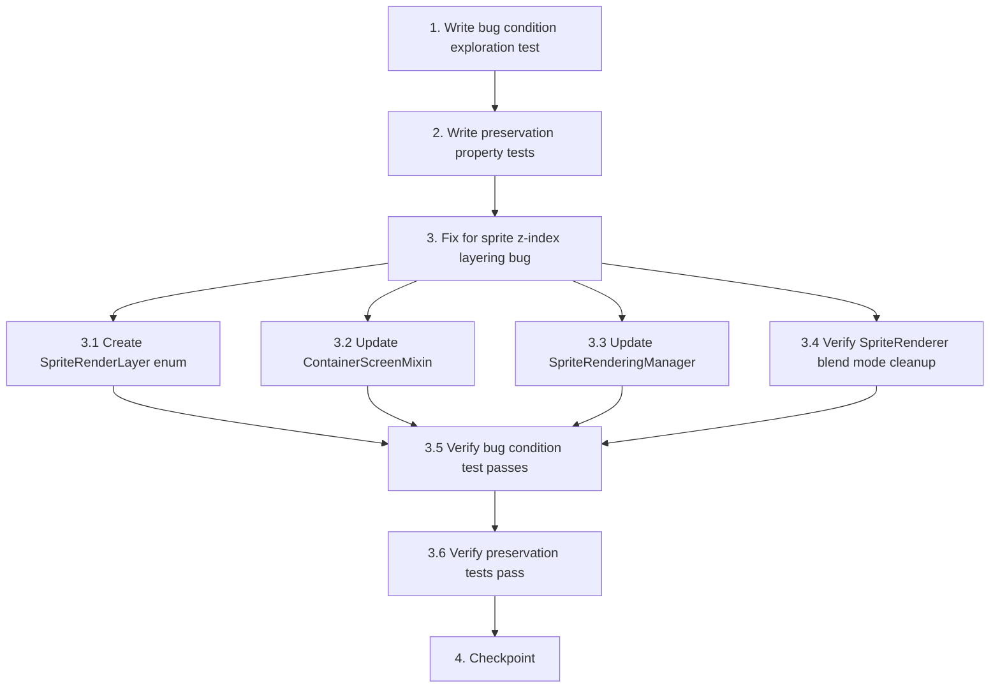

# Implementation Plan

## Overview

This implementation plan follows the bugfix workflow using the bug condition methodology. The plan consists of three phases:

1. **Exploration Phase**: Write bug condition tests that will FAIL on unfixed code to confirm the bug exists
2. **Preservation Phase**: Write tests that capture existing correct behavior to prevent regressions
3. **Implementation Phase**: Apply the fix and verify both bug condition and preservation tests pass

The fix addresses sprite z-index layering issues by introducing a proper render layer system (BACKGROUND, GUI, FOREGROUND) that maps z_index values to Minecraft's GUI render pipeline stages.

## Tasks

- [x] 1. Write bug condition exploration test
  - **Property 1: Bug Condition** - Z-Index Layer Mapping Verification
  - **CRITICAL**: This test MUST FAIL on unfixed code - failure confirms the bug exists
  - **DO NOT attempt to fix the test or the code when it fails**
  - **NOTE**: This test encodes the expected behavior - it will validate the fix when it passes after implementation
  - **GOAL**: Surface counterexamples that demonstrate the bug exists
  - **Scoped PBT Approach**: Test concrete failing cases: sprites with z_index < 0 rendering in wrong layer, sprites not sorted within layer
  - Test that sprites with z_index < 0 render in BACKGROUND layer (before GUI background texture)
  - Test that sprites with z_index == 0 render in GUI layer (alongside GUI elements)
  - Test that sprites with z_index > 0 render in FOREGROUND layer (after GUI contents)
  - Test that sprites within the same layer are sorted by z_index in ascending order
  - Test that ContainerScreenMixin uses fragile Matrix3x2fStack.popMatrix() injection point (confirms fragility)
  - Run test on UNFIXED code
  - **EXPECTED OUTCOME**: Test FAILS (this is correct - it proves the bug exists)
  - Document counterexamples found:
    - Sprite with z_index = -999 renders on top of GUI elements instead of behind them
    - Sprites in same layer render in undefined order instead of z_index sorted order
    - Injection point uses fragile internal library method
  - Mark task complete when test is written, run, and failure is documented
  - _Requirements: 1.1, 1.2, 1.3, 1.5_

- [x] 2. Write preservation property tests (BEFORE implementing fix)
  - **Property 2: Preservation** - Sprite Rendering Behavior Preservation
  - **IMPORTANT**: Follow observation-first methodology
  - Observe behavior on UNFIXED code for sprite transformations, animations, and positioning
  - Observe: Animated sprites cycle through frames correctly on unfixed code
  - Observe: Rotation, scale, and anchor transformations work correctly on unfixed code
  - Observe: Blend modes (NORMAL, ADD, MULTIPLY) apply correctly on unfixed code
  - Observe: Sprites render on correct GUI screens (inventory, chest, furnace) on unfixed code
  - Write property-based tests capturing observed behavior patterns:
    - For all sprite configurations with animations, frame playback continues correctly
    - For all sprite configurations with transformations (rotation, scale, position), transformations apply correctly
    - For all sprite configurations with blend modes, blend modes apply correctly
    - For all sprite configurations targeting specific screens, sprites render on correct screens
  - Property-based testing generates many test cases for stronger guarantees
  - Run tests on UNFIXED code
  - **EXPECTED OUTCOME**: Tests PASS (this confirms baseline behavior to preserve)
  - Mark task complete when tests are written, run, and passing on unfixed code
  - _Requirements: 3.1, 3.2, 3.3, 3.4, 3.5_

- [ ] 3. Fix for sprite z-index layering bug

  - [x] 3.1 Create SpriteRenderLayer enum (if not already exists)
    - Verify enum has three values: BACKGROUND, GUI, FOREGROUND
    - Verify fromZIndex() method maps z_index values correctly:
      - z_index < 0 → BACKGROUND
      - z_index == 0 → GUI
      - z_index > 0 → FOREGROUND
    - _Bug_Condition: isBugCondition(sprite) where sprite.zIndex < 0 OR notSortedWithinLayer(sprite) OR usesFragileInjectionPoint()_
    - _Expected_Behavior: Sprites render in correct layer based on z_index mapping (BACKGROUND for z < 0, GUI for z == 0, FOREGROUND for z > 0) and are sorted within each layer_
    - _Preservation: Sprite transformations, animations, blend modes, positioning, and screen targeting remain unchanged_
    - _Requirements: 2.1, 2.2, 2.3_

  - [-] 3.2 Update ContainerScreenMixin with stable injection points
    - Remove fragile Matrix3x2fStack.popMatrix() injection point
    - Add BACKGROUND layer injection: `@Inject(method = "renderBg", at = @At("HEAD"))`
    - Add GUI layer injection: `@Inject(method = "renderBg", at = @At("TAIL"))`
    - Add FOREGROUND layer injection: `@Inject(method = "renderLabels", at = @At("TAIL"))`
    - Each injection method should pass the appropriate SpriteRenderLayer enum value to SpriteRenderingManager
    - Ensure each render stage is independent with proper GL state cleanup
    - _Bug_Condition: usesFragileInjectionPoint() where injection targets Matrix3x2fStack.popMatrix()_
    - _Expected_Behavior: Injection points use stable Minecraft render methods (renderBg, renderLabels)_
    - _Preservation: Sprite rendering on correct screens continues to work_
    - _Requirements: 2.1, 2.2, 2.3, 2.5_

  - [-] 3.3 Update SpriteRenderingManager to filter and sort by layer
    - Fix compilation error: Remove or fix undefined `foreground` variable reference in anchor calculation
    - Implement layer filtering: Filter sprites by SpriteRenderLayer using `SpriteRenderLayer.fromZIndex(sprite.zIndex) == layer`
    - Implement within-layer sorting: Sort sprites by z_index in ascending order using `.sorted((a, b) -> Integer.compare(a.zIndex, b.zIndex))`
    - Verify renderSpritesForLayer accepts and uses the SpriteRenderLayer parameter correctly
    - _Bug_Condition: notSortedWithinLayer(sprite) where sprites in same layer render in undefined order_
    - _Expected_Behavior: Sprites filtered by layer and sorted by z_index within each layer_
    - _Preservation: Sprite positioning, screen targeting, and anchor calculations remain unchanged_
    - _Requirements: 2.1, 2.2, 2.3, 2.4_

  - [-] 3.4 Verify SpriteRenderer blend mode cleanup (should already be correct)
    - Confirm SpriteBlend.resetBlend() is called in a finally block
    - Verify blend mode reset happens even if renderSprite() throws an exception
    - If not in finally block, move it there
    - _Bug_Condition: blendModeNotInFinallyBlock() where resetBlend() called outside finally_
    - _Expected_Behavior: Blend mode reset in finally block to prevent GL state corruption_
    - _Preservation: Blend mode application behavior remains unchanged_
    - _Requirements: 2.6_

  - [ ] 3.5 Verify bug condition exploration test now passes
    - **Property 1: Expected Behavior** - Z-Index Layer Mapping Verification
    - **IMPORTANT**: Re-run the SAME test from task 1 - do NOT write a new test
    - The test from task 1 encodes the expected behavior
    - When this test passes, it confirms the expected behavior is satisfied
    - Run bug condition exploration test from step 1
    - **EXPECTED OUTCOME**: Test PASSES (confirms bug is fixed)
    - Verify sprites with z_index < 0 now render in BACKGROUND layer
    - Verify sprites with z_index == 0 now render in GUI layer
    - Verify sprites with z_index > 0 now render in FOREGROUND layer
    - Verify sprites within same layer are now sorted by z_index
    - Verify ContainerScreenMixin now uses stable injection points
    - _Requirements: 2.1, 2.2, 2.3, 2.4, 2.5_

  - [ ] 3.6 Verify preservation tests still pass
    - **Property 2: Preservation** - Sprite Rendering Behavior Preservation
    - **IMPORTANT**: Re-run the SAME tests from task 2 - do NOT write new tests
    - Run preservation property tests from step 2
    - **EXPECTED OUTCOME**: Tests PASS (confirms no regressions)
    - Confirm all tests still pass after fix (no regressions)
    - Verify sprite animations continue to work correctly
    - Verify sprite transformations (rotation, scale, anchor) continue to work correctly
    - Verify blend modes continue to work correctly
    - Verify screen targeting continues to work correctly
    - _Requirements: 3.1, 3.2, 3.3, 3.4, 3.5_

- [ ] 4. Checkpoint - Ensure all tests pass
  - Ensure all tests pass, ask the user if questions arise.

## Task Dependency Graph



```json
{
  "waves": [
    {
      "name": "Wave 1: Exploration and Preservation Tests",
      "tasks": ["1", "2"]
    },
    {
      "name": "Wave 2: Implementation",
      "tasks": ["3.1", "3.2", "3.3", "3.4"]
    },
    {
      "name": "Wave 3: Verification",
      "tasks": ["3.5", "3.6"]
    },
    {
      "name": "Wave 4: Checkpoint",
      "tasks": ["4"]
    }
  ]
}
```

## Notes

- **Task 1 (Bug Condition Test)**: This test MUST fail on unfixed code. Do not attempt to fix the test or code when it fails - the failure confirms the bug exists.
- **Task 2 (Preservation Tests)**: Follow observation-first methodology - observe behavior on unfixed code first, then write tests capturing that behavior.
- **Task 3.5 (Verify Bug Fix)**: Re-run the SAME test from Task 1 - do NOT write a new test. When it passes, the bug is confirmed fixed.
- **Task 3.6 (Verify Preservation)**: Re-run the SAME tests from Task 2 - do NOT write new tests. When they pass, no regressions occurred.
- **Property-Based Testing**: Tasks 1 and 2 use the **Property N:** format to enable hover status tracking in the IDE.
